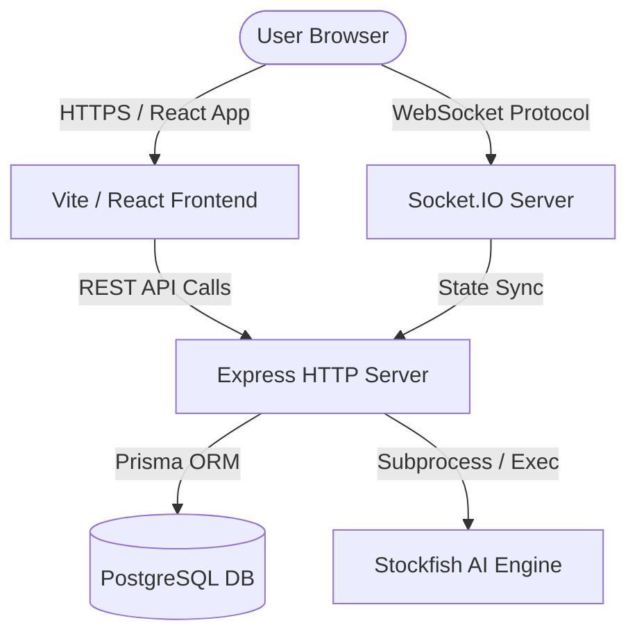
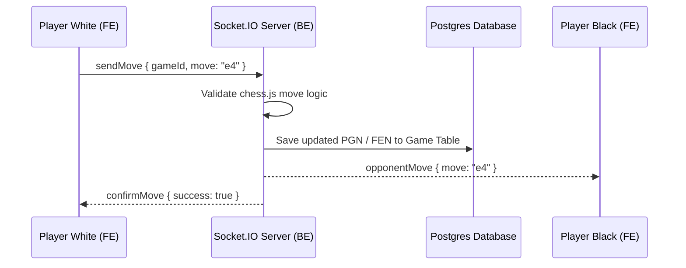

# ChessPlay System Architecture

## Purpose
This document provides a high-level overview of the ChessPlay system design, component topologies, communication models, and data storage structures.

## Navigation
[README](README.md) • [API.md](API.md) • [docs/architecture.md](docs/architecture.md) • [docs/database.md](docs/database.md) • [docs/socket-events.md](docs/socket-events.md)

---

## Architecture Overview
ChessPlay uses a modular monorepo architecture divided into a React frontend client and a Node.js/Express backend server, coordinated via a PostgreSQL database and synchronized in real-time through WebSockets.

### Core Subsystems

#### 1. React Frontend (`frontend/`)
A single-page application built on Vite, React, Tailwind CSS, Zustand (lightweight client state), and Redux (monetization and complex UI interactions). Handles board rendering, drag-and-drop moves, live chats, waitlists, and billing workflows.

#### 2. Express Backend (`backend/`)
An Express server written in TypeScript. Exposes REST endpoints for user authentication, payment processing, waitlist submissions, and admin telemetry. Integrates with the Stockfish chess binary for Play vs AI capabilities.

#### 3. Database Layer (`backend/prisma/`)
Powered by PostgreSQL and modeled using Prisma ORM. Stores user profiles, payment records, active/completed game states, referral mappings, and imported chess puzzles.

#### 4. Real-Time Engine (Socket.IO)
Coordinates active matches, processes board updates, syncs chess clock timers, and routes player chat messages.

---

## Examples

### 1. Multiplayer Socket Sync Flow

---

## Notes
- > [!IMPORTANT]
  > Stockfish runs directly on the backend server node via local spawn mechanisms rather than consuming external SaaS computation.
- > [!TIP]
  > Read-intensive endpoints (e.g., Chess Leaderboards) utilize query index filters to minimize database load times.

---

## Best Practices
- **Strict Decoupling**: Keep chess game logic (`chess.js`) on both frontend and backend to enable instant client-side optimistic rendering and secure server-side validation.
- **WebSocket Reconnections**: Always handle network dropouts gracefully by caching game tokens in browser `localStorage`.
- **Database Safety**: Never expose Prisma raw query queries to client controllers.

---

## References
- [Deep-dive Subsystem Guides](docs/architecture.md)
- [Database Schema Design](docs/database.md)
- [Socket Connection Guidelines](docs/socket-events.md)
