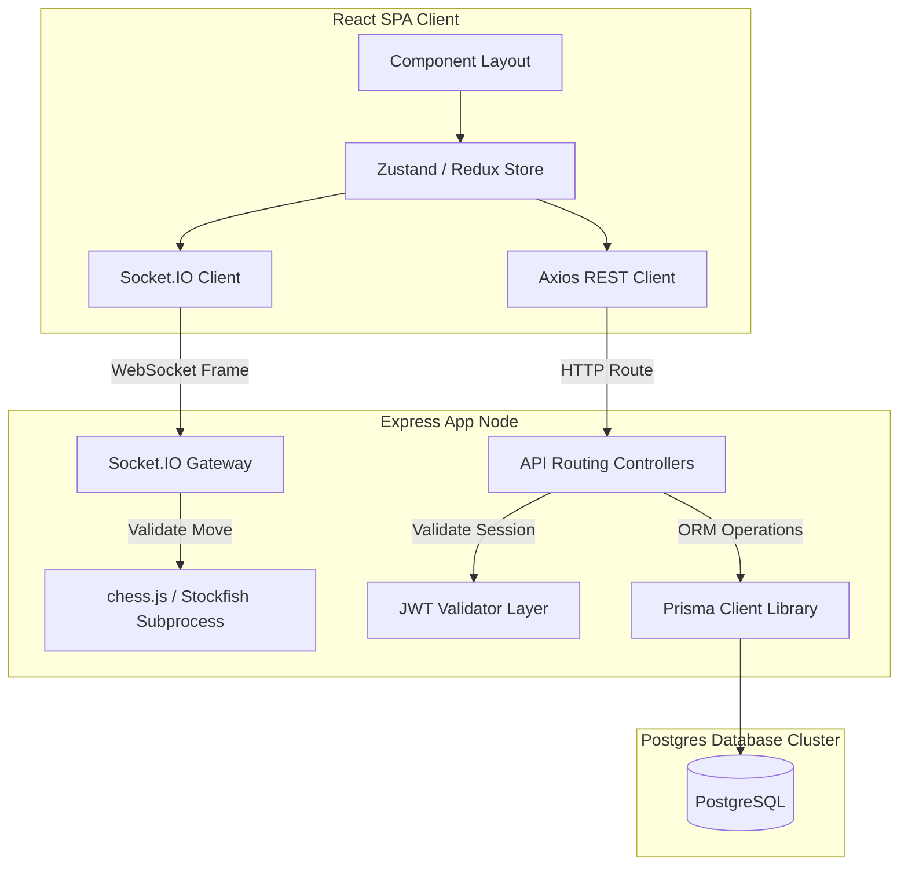
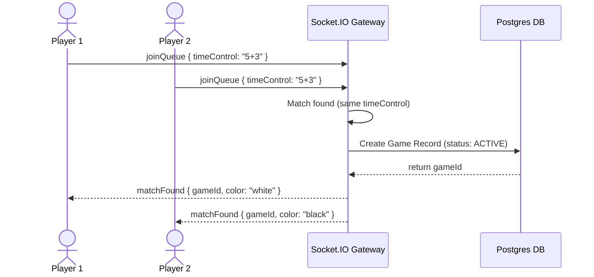

# Technical Architecture Deep Dive

## Purpose
This document provides an in-depth exploration of ChessPlay's software architecture, system layers, data flows, and module responsibilities.

## Navigation
[README](../README.md) • [ARCHITECTURE.md](../ARCHITECTURE.md) • [backend.md](backend.md) • [frontend.md](frontend.md) • [database.md](database.md)

---

## Architectural Layout
ChessPlay is architected as a decoupled client-server monorepo with distinct separation of concerns:

### Key Architectural Layers

#### 1. Presentation Layer (React Client)
- Responsible for board rendering, animation transitions (Framer Motion), game inputs, and profile interactions.
- Client state is split: **Zustand** manages real-time matchmaking, lobby lists, and active board states; **Redux Toolkit** handles subscription gates, user badges, billing modules, and global notifications.

#### 2. Communication Layer (WebSockets & REST)
- **HTTP REST API**: Used for stateless operations (e.g., auth registration, waitlist entry, stripe transactions).
- **WebSockets (Socket.IO)**: Used for bi-directional state synchronization (e.g., chess moves, chess clocks, live matchmaking queues, peer-to-peer game chats).

#### 3. Domain Logic Layer (Express & Stockfish)
- Validates chess moves on the server side using the pure-JS game rules engine `chess.js`.
- Manages AI game engines by spawning Stockfish binaries in backend worker threads to return move recommendations.

#### 4. Data Access Layer (Prisma ORM)
- Abstracts PostgreSQL operations into typed TypeScript methods.
- Enforces relational foreign keys, manages transaction queries, and runs index-level filtering.

---

## Examples

### 1. High-Level Matchmaking Lifecycle

---

## Notes
- > [!IMPORTANT]
  > Both client and server run move verification. The client runs verification for optimistic UI rendering; the server runs it to prevent injection of illegal moves.
- > [!NOTE]
  > Relational records like `User` and `Game` contain MongoDB reference fields (`mongoUserId`, `mongoGameId`) to ease synchronization with legacy databases.

---

## Best Practices
- **Never trust the client**: Always perform complete board validation on the backend before writing game moves to Postgres.
- **Stateless API Design**: Keep HTTP controllers fully stateless, relying on JWT tokens for user authentication context.
- **Graceful WS Dropouts**: Ensure the socket gateway automatically handles temporary disconnects by retaining matching queues in-memory for 30 seconds.

---

## References
- [System Architecture High Level Outline](../ARCHITECTURE.md)
- [Database Schema Representation](database.md)
- [Express Backend Specification Guide](backend.md)
