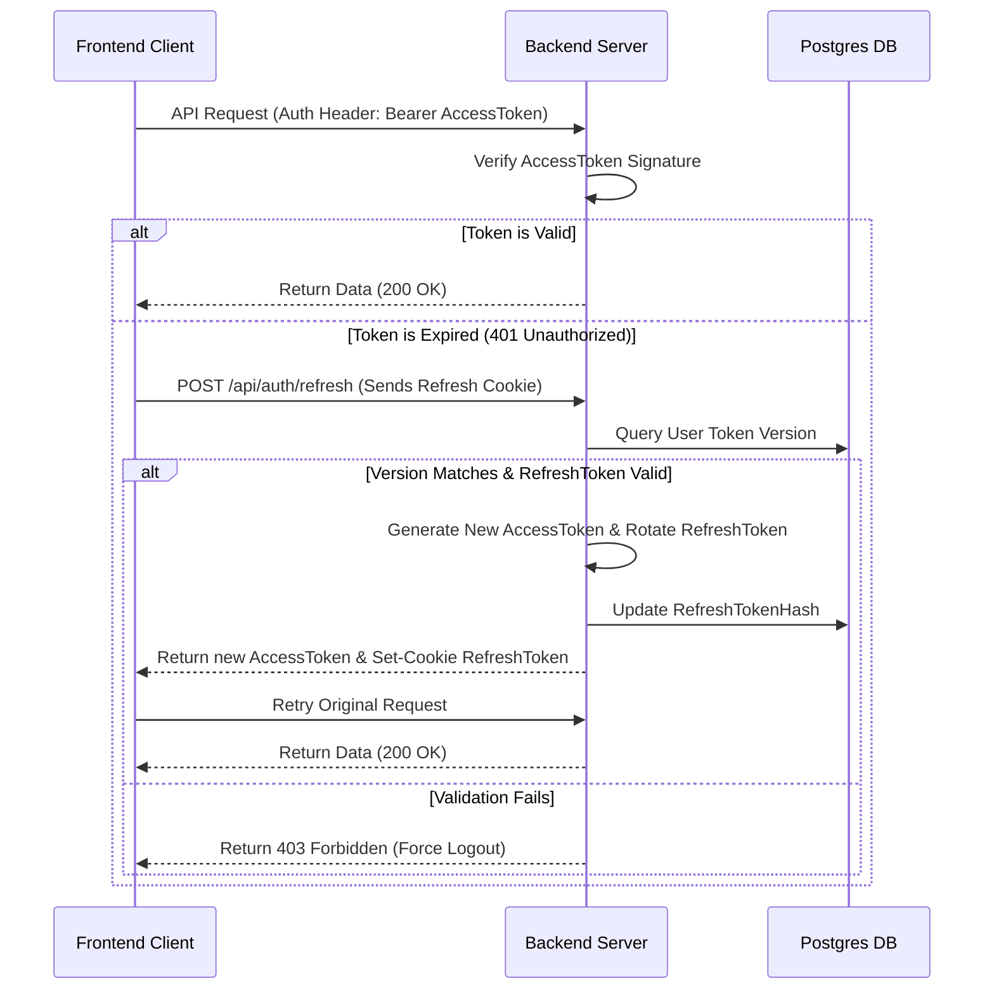

# Authentication Lifecycle & Security

## Purpose
This document describes the design of ChessPlay's user identity verification, JWT rotation flows, token version checks, and verification operations.

## Navigation
[README](../README.md) • [security.md](security.md) • [api.md](api.md) • [SECURITY.md](../SECURITY.md)

---

## Token Architecture

ChessPlay implements a high-security token rotation architecture for user sessions:
- **Access Tokens**: Short-lived JSON Web Tokens (JWT) signed using `JWT_ACCESS_SECRET`. Encoded with the user identity and role. Expires in **15 minutes**. Sent to client memory.
- **Refresh Tokens**: Long-lived tokens signed using `JWT_REFRESH_SECRET`. Stored securely as an `httpOnly`, `secure`, and `sameSite: strict` cookie. Expires in **7 days**. Encoded with user identity and a database-backed token version.

---

## Operations & Cycles

### 1. The Token Rotation Flow


### 2. Token Versioning (Single-Device & Global Logout)
To permit immediate revocation of sessions (e.g., when a user changes their password or clicks "Log Out All Devices"):
- Each `User` record in PostgreSQL has a `tokenVersion` counter (default: `0`).
- The user's current token version is embedded inside the issued JWT.
- During authorization checks, the backend validates if the version encoded in the JWT matches the current `tokenVersion` in the DB.
- **To Revoke Sessions**: Simply increment `tokenVersion` in the database. All existing refresh tokens will immediately fail verification checks.

---

## Examples

### 1. Issuing JWT Payload
```typescript
import jwt from 'jsonwebtoken';

export const generateAccessToken = (user: { id: string; role: string }): string => {
  return jwt.sign(
    { userId: user.id, role: user.role },
    process.env.JWT_ACCESS_SECRET!,
    { expiresIn: '15m' }
  );
};

export const generateRefreshToken = (user: { id: string; tokenVersion: number }): string => {
  return jwt.sign(
    { userId: user.id, version: user.tokenVersion },
    process.env.JWT_REFRESH_SECRET!,
    { expiresIn: '7d' }
  );
};
```

### 2. Express Route Validation Middleware
```typescript
import { Request, Response, NextFunction } from 'express';
import jwt from 'jsonwebtoken';

export const validateAccess = (req: Request, res: Response, next: NextFunction) => {
  const authHeader = req.headers.authorization;
  const token = authHeader && authHeader.split(' ')[1];

  if (!token) return res.status(401).json({ success: false, message: 'Missing token' });

  jwt.verify(token, process.env.JWT_ACCESS_SECRET!, (err, decoded) => {
    if (err) return res.status(401).json({ success: false, message: 'Invalid or expired token' });
    req.user = decoded;
    next();
  });
};
```

---

## Notes
- > [!IMPORTANT]
  > Refresh tokens are hashed (`SHA-256`) before being written to PostgreSQL to prevent attackers from hijacking sessions even if the database is read.
- > [!WARNING]
  > Never expose raw user IDs or email details inside the JWT claims to minimize exposure during transit.

---

## Best Practices
- **Verify email on signup**: Block user access to multiplayer matchrooms until their email status is flagged as verified.
- **Token rotation validation**: When performing a refresh rotation, invalidating the old token prevents replay attacks.
- **Store secrets safely**: Generate unique 64-character cryptographically random secrets for access and refresh signatures.

---

## References
- [REST API Authorization Interfaces](api.md)
- [Prisma User Table Definitions](database.md)
- [Monorepo Security Protections](security.md)
