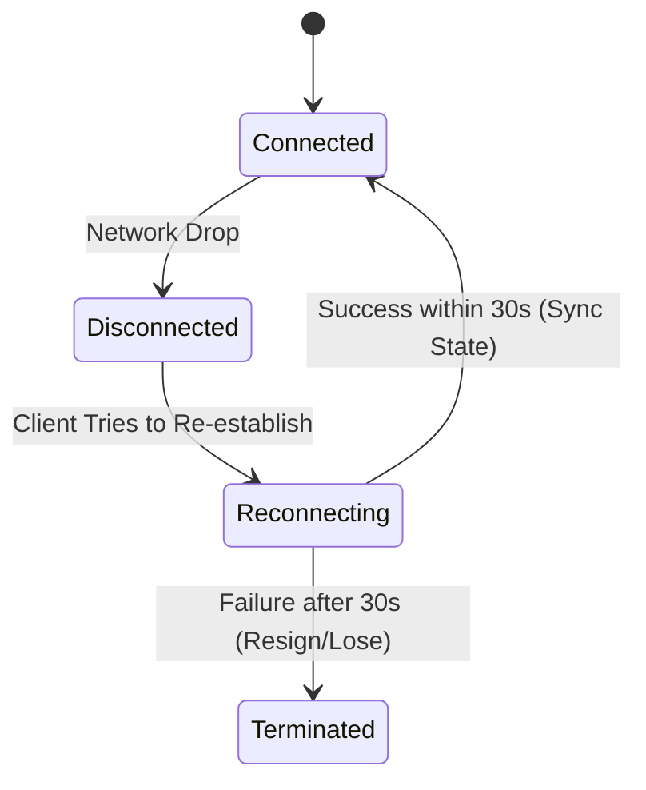

# Technical FAQ

## Purpose
This document provides deep technical answers to frequently asked questions about ChessPlay's architecture, game engines, WebSockets, database design, and monetization.

## Navigation
[README](../README.md) • [FAQ.md](../FAQ.md) • [TROUBLESHOOTING.md](../TROUBLESHOOTING.md) • [architecture.md](architecture.md)

---

## Technical Questions

### 1. Game State and Synchronization

#### How are board state mismatches handled?
If a player's browser displays a move that is not acknowledged by the backend:
1. The server discards the invalid move and broadcasts the official `opponentMove` payload with the current correct FEN.
2. The client's local board automatically resets to the received FEN.
3. This prevents players from bypassing client constraints to make illegal moves.

#### What happens if a player disconnects?
When a player disconnects:
1. The backend socket manager updates the game room status and starts a **30-second countdown timer**.
2. If the user reconnects during this window, the socket sends the game state to synchronize the board.
3. If the timer expires, the match is completed, and the opponent is awarded the victory due to abandonment.

---

### 2. Stockfish and AI Engines

#### Why does the Stockfish process occasionally crash?
This is typically due to server-side resource constraints:
- **Depth settings**: Searching deeper than depth 15 can consume too much memory and CPU. Limit search depth on small containers.
- **Binary compilation**: Ensure the binary matches the server's OS architecture.

---

### 3. Database & Performance

#### Why did we choose PostgreSQL over MongoDB for game states?
PostgreSQL provides strong transaction safety and data integrity:
- Relational tables verify that users exist before matches start.
- Foreign key constraints prevent orphans.
- SQL index searches speed up leaderboards and game history lookups.

---

## Examples

### 1. Handling Socket Reconnect State Flow

---

## Notes
- > [!IMPORTANT]
  > Stockfish computations run inside child processes on the server. Make sure you use a hosting plan that supports persistent CPU resources.
- > [!TIP]
  > Use `EXPLAIN` on database queries to ensure searches are utilizing indexes rather than running slow full table scans.

---

## Best Practices
- **Verify Webhook Signatures**: Validate incoming payloads from Razorpay or Stripe to prevent unauthorized upgrades.
- **Enforce Rate Limits**: Protect authentication endpoints from brute-force attempts.
- **Keep Databases Clean**: Periodically purge expired device tokens and stale waitlist entries.

---

## References
- [General FAQ](../FAQ.md)
- [Troubleshooting & Diagnostics](../TROUBLESHOOTING.md)
- [System Architecture Blueprints](architecture.md)
