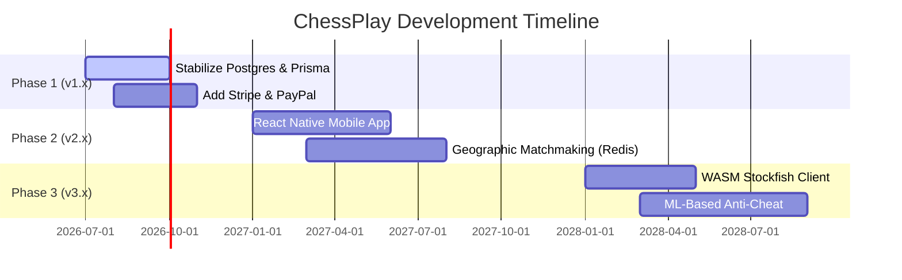

# Strategic Development Roadmap

## Purpose
This document provides a detailed breakdown of the technical milestones, feature planning, and execution phases scheduled for the ChessPlay platform.

## Navigation
[README](../README.md) • [ROADMAP.md](../ROADMAP.md) • [architecture.md](architecture.md) • [release-process.md](release-process.md)

---

## Strategic Phases



---

## Detailed Milestone Feature Sets

### Phase 1: Platform Stabilization (v1.x)
- **Prisma Migration Alignment**: Normalize relational tables and resolve legacy MongoDB schema fields.
- **Razorpay, Stripe & PayPal Drivers**: Implement abstract billing interfaces supporting multiple processors under a unified webhook listener.
- **Sentry Trace Tracking**: Log SQL execution traces and WebSocket latency in production dashboards.

### Phase 2: Native App and Scalability (v2.x)
- **React Native Application**: Build native iOS and Android versions using Expo, reuse Redux state actions, and package chessboard themes.
- **Redis Sync Adapter**: Scale the Socket.IO server horizontally behind load balancers using Redis Pub/Sub adapters.
- **Advanced Matchmaking**: Introduce matchmaking algorithms that pair users based on rating similarity and connection latencies.

### Phase 3: Advanced Engines and Fraud Checks (v3.x)
- **ML Anti-Cheat System**: Train local neural network filters to parse move intervals, comparing player timelines with Stockfish recommendation lines.
- **WASM Stockfish Engine**: Migrate computation loads to the client's device using service worker threads.

---

## Examples

### 1. Unified Billing Driver Interface Spec
To add Stripe or PayPal driver classes during Phase 1 development:
```typescript
export interface PaymentDriver {
  createOrder(amount: number, currency: string): Promise<PaymentOrder>;
  verifyWebhook(payload: any, signature: string): Promise<boolean>;
  processRefund(transactionRef: string): Promise<boolean>;
}
```

---

## Notes
- > [!IMPORTANT]
  > Feature priorities are adjusted quarterly based on feedback collected through `/api/feedback` controllers.
- > [!TIP]
  > During the Phase 2 mobile migration, frontend Redux stores can be reused directly by changing only the storage layer to Async Storage.

---

## Best Practices
- **Implement behind flags**: Always deploy new features (like Stripe checkout routes) behind database-backed features flags to verify stability.
- **Maintain backward compatibility**: Keep APIs backward compatible to prevent breaking older client versions when deploying new updates.
- **Document API updates**: Ensure `docs/api.md` is updated simultaneously when adding new routes.

---

## References
- [High-Level Product Roadmap File](../ROADMAP.md)
- [System Architecture Blueprints](architecture.md)
- [API Route Specifications Guide](api.md)
