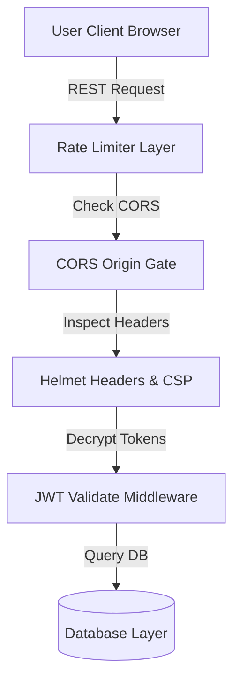

# Platform Security Controls

## Purpose
This document describes the design and configuration of ChessPlay's defensive security layers, headers, encryption policies, and database access controls.

## Navigation
[README](../README.md) • [SECURITY.md](../SECURITY.md) • [authentication.md](authentication.md) • [database.md](database.md)

---

## Defensive Engineering Layers

ChessPlay enforces a multi-tier defense-in-depth security model:



### 1. HTTP Headers & Content Security Policy (CSP)
We utilize `helmet` to manage HTTP security headers, protecting players from Cross-Site Scripting (XSS), Clickjacking, and packet sniffing:
- **Strict-Transport-Security (HSTS)**: Enforces connection over HTTPS.
- **Content-Security-Policy (CSP)**: Allowlists trusted domains for scripts, fonts, styles, and WebSockets.
- **Cross-Origin Opener Policy (COOP) & Cross-Origin Embedder Policy (COEP)**: Required to enable `SharedArrayBuffer` in browsers for running high-depth Stockfish engines locally.

### 2. Request Rate Limiting
To block automated dictionary attacks and denial-of-service attempts:
- Standard REST paths are limited to **100 requests per 15-minute window**.
- Authentication paths (login, register, reset password) allow only **10 attempts per minute**.

---

## Examples

### 1. Express Security Headers Config (Helmet)
```typescript
import express from 'express';
import helmet from 'helmet';

const app = express();

app.use(
  helmet({
    contentSecurityPolicy: {
      directives: {
        defaultSrc: ["'self'"],
        scriptSrc: ["'self'", "'unsafe-eval'", "https://checkout.razorpay.com"],
        connectSrc: ["'self'", "https://api.razorpay.com", "wss://*.chessplay.xyz"],
        frameSrc: ["'self'", "https://api.razorpay.com", "https://checkout.razorpay.com"]
      }
    }
  })
);
```

### 2. Authentication Rate Limiter Definition
```typescript
import rateLimit from 'express-rate-limit';

export const authRateLimiter = rateLimit({
  windowMs: 60 * 1000, // 1 minute
  max: 10,             // Limit each IP to 10 register/login requests per window
  message: {
    success: false,
    error: {
      code: 'RATE_LIMIT_EXCEEDED',
      message: 'Too many authentication attempts. Please try again after 1 minute.'
    }
  },
  standardHeaders: true,
  legacyHeaders: false
});
```

---

## Notes
- > [!IMPORTANT]
  > When testing payment webhooks, verify that you validate signatures cryptographically on the server using `crypto.timingSafeEqual` to prevent timing attacks.
- > [!CAUTION]
  > Do not configure CORS origins as wildcard (`*`) in production. The value must match the exact schema and domain of the frontend app.

---

## Best Practices
- **Implement CSRF Guards**: Use double submit cookies or custom verification headers to shield mutations from CSRF attacks.
- **Sanitize Inputs**: Run user-supplied strings through sanitizer utilities (e.g. `validator` or `dompurify`) to neutralize HTML injections.
- **Lock Down DB Access**: Grant PostgreSQL connection credentials read/write access solely on the schema collections they serve.

---

## References
- [Monorepo Security Overview Policies](../SECURITY.md)
- [Helmet Express Package Documentation](https://helmetjs.github.io/)
- [Authentication Operations Design](authentication.md)
